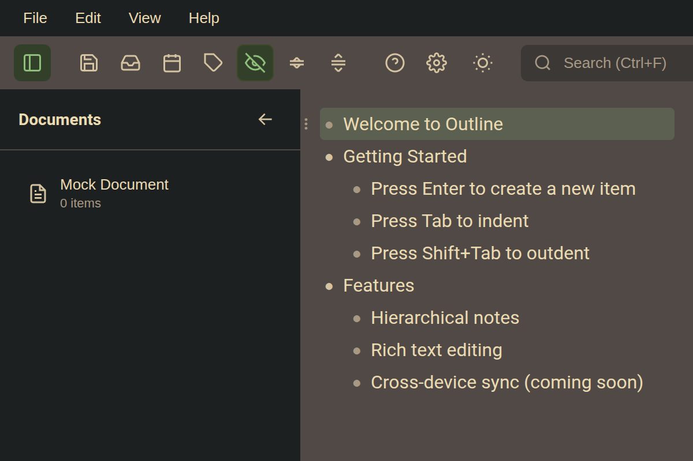

# Outline

A self-hosted outliner for hierarchical notes, tasks, and knowledge management. Built as a Dynalist/Workflowy replacement with cross-linking, calendar integration, and offline-first sync.



## Features

- **Hierarchical outlining** - Infinite nesting with zoom/hoist, collapse/expand
- **Wiki-style linking** - `[[link to any node]]` with backlinks panel
- **Task management** - Checkboxes, due dates, recurring tasks
- **Calendar integration** - iCalendar feed for Google Calendar, Apple Calendar, etc.
- **Keyboard-first** - Full keyboard navigation and shortcuts
- **Offline-first** - Edit on multiple machines, sync via Dropbox/Syncthing
- **Mobile capture** - Quick inbox from phone via web form or API

## Status

Active development. Core outlining, search, tasks, and calendar features are working.

## Quick Start

### Prerequisites

- [Node.js](https://nodejs.org/) 18+
- [Rust](https://rustup.rs/) (for desktop app)
- [Tauri prerequisites](https://tauri.app/start/prerequisites/)

### Run the Desktop App

```bash
cd app
npm install
npm run tauri dev
```

This starts the Tauri desktop application with hot reload.

### Run in Browser (Development Only)

```bash
cd app
npm install
npm run dev
```

Opens at http://localhost:5173. Browser mode uses mock data (not persisted).

## Usage

### Keyboard Shortcuts

| Action | Shortcut |
|--------|----------|
| New item | `Enter` |
| Indent | `Tab` |
| Outdent | `Shift+Tab` |
| Delete item | `Ctrl+Shift+Backspace` |
| Navigate | `↑` / `↓` |
| Swap with sibling | `Ctrl+↑` / `Ctrl+↓` |
| Toggle collapse | `Ctrl+.` |
| Toggle checkbox | `Ctrl+Enter` |
| Search | `Ctrl+F` / `Ctrl+Shift+F` |
| Go to document | `Ctrl+O` |
| Go to item | `Ctrl+Shift+O` |
| Move item to... | `Ctrl+Shift+M` |
| Set date | `Ctrl+D` |
| Date views | `Ctrl+Shift+T` |
| Inbox | `Ctrl+I` |

### Data Location

Documents are stored in `~/.outline-data/`:

```
~/.outline-data/
├── documents/
│   └── {uuid}/
│       ├── state.json          # Current document state
│       └── pending.*.jsonl     # Uncommitted changes
├── inbox.jsonl                 # Captured items
└── .cache/
    └── outline.db              # Search index (not synced)
```

### Multi-Machine Sync

1. Sync `~/.outline-data/` via Dropbox, Syncthing, or similar
2. Each machine writes to its own `pending.{hostname}.jsonl`
3. On load, all pending changes merge automatically (last-write-wins)
4. Click "Save" to compact pending files into `state.json`

## Server Setup (Optional)

The thin server enables mobile capture and calendar feeds. It's optional - the desktop app works standalone.

### Prerequisites

- Ruby 3.x
- Bundler

### Setup

```bash
cd server
bundle install
cp config.json.example config.json
# Edit config.json with your data_dir and calendar tokens
```

### Run

```bash
bundle exec puma -p 9292
```

### Endpoints

| Endpoint | Auth | Description |
|----------|------|-------------|
| `GET /health` | None | Health check |
| `GET /calendar/{token}/feed.ics` | Token in URL | Calendar feed |
| `GET /outline/capture` | Basic Auth | Mobile capture form |
| `POST /outline/api/inbox` | Basic Auth | API capture |

See [server/README.md](server/README.md) for nginx configuration.

## Development

### Desktop App

```bash
cd app
npm run dev          # Vite dev server (browser mode)
npm run tauri dev    # Full Tauri app with Rust backend
npm run check        # TypeScript/Svelte type checking
npm run test         # Playwright E2E tests
```

### Rust Backend

```bash
cd app/src-tauri
cargo build          # Build
cargo test           # Run tests
cargo check          # Type check
```

### Project Structure

```
app/
├── src/                    # Svelte 5 frontend
│   ├── lib/
│   │   ├── outline.svelte.ts   # Core state management
│   │   ├── api.ts              # Tauri IPC / mock fallback
│   │   └── *.svelte            # UI components
│   └── routes/
│       └── +page.svelte        # Main page
├── src-tauri/              # Rust backend
│   └── src/
│       ├── commands.rs         # Tauri command handlers
│       ├── data/               # Document, Node, Operations
│       └── search/             # SQLite FTS5 index
└── tests/                  # Playwright E2E tests

server/                     # Ruby/Sinatra thin server
├── app.rb
└── views/
```

## Architecture

```
┌────────────────────────────────────────────┐
│         Desktop App (Tauri + Svelte)       │
│  • Rich editing UI                         │
│  • SQLite search cache                     │
│  • JSONL file persistence                  │
└────────────────────────────────────────────┘
                    │
                    ▼
┌────────────────────────────────────────────┐
│         Local Files (~/.outline-data/)     │
│  • state.json (merged document state)      │
│  • pending.*.jsonl (per-machine changes)   │
└────────────────────────────────────────────┘
                    │ File sync
                    ▼
┌────────────────────────────────────────────┐
│         Thin Server (Ruby/Sinatra)         │
│  • Mobile capture → inbox.jsonl            │
│  • Calendar feed (iCal)                    │
│  • Read-only viewer                        │
└────────────────────────────────────────────┘
```

## License

MIT
